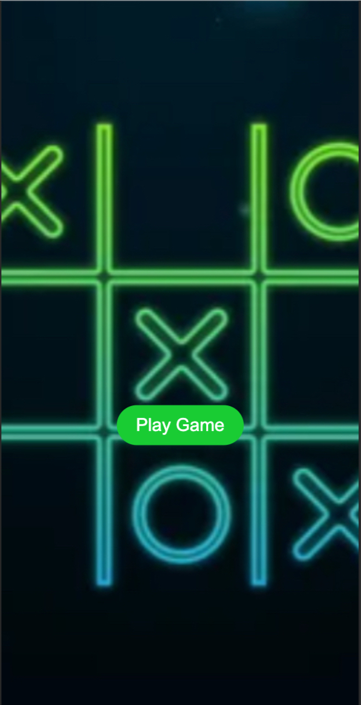

# tictactoe game
tictactoe game using HTML, CSS and JavaScript

---

## Table of Contents
- [Introduction](#introduction)
- [Target Audience](#target-audience)
- [Wireframe](#wireframe)
- [Play Game Page](#play-game-page)
  - [Laptop View](#laptop-view)
  - [Mobile View](#mobile-view)
- [Tic Tac Toe Game - Screenshots and Explanation](#tic-tac-toe-game---screenshots-and-explanation)
  - [Game Area](#game-area)
  - [Player Has Won Indicator](#player-has-won-indicator)
  - [Winning Indicator](#winning-indicator)
  - [Score for Player X and O](#score-for-player-x-and-o)
  - [New Round](#new-round)
  - [New Game](#new-game)
- [Issues and Challenges](#issues-and-challenges)
- [Performance Testing - Lighthouse Results](#performance-testing---lighthouse-results)
- [Credits](#credits)
- [Conclusion](#conclusion)

---

## Introduction
 I'm thrilled to share my latest project, a significant milestone in my web development journey. It all began with Kaizen Fitness, my first venture into HTML and CSS. That experience sparked my passion for crafting visually appealing web layouts.

Then, I delved into JavaScript—an exciting journey into a world of endless possibilities! Learning JavaScript opened doors to creating dynamic and interactive websites. This project you're seeing now is the fruit of that journey, where I've applied my JavaScript skills to build an interactive tictactoe game.

---

## Target Audience
My target audience primarily includes individuals interested in playing the classic Tic Tac Toe game, engaging in a fun two-player experience with X and O. Whether you're looking for a familiar game to play with friends or eager to challenge yourself in this traditional yet captivating game, this project welcomes players of all levels!

---

## Wireframe

---

## play Game page
The Play Game page serves as the entry point to the Tic Tac Toe gaming experience. Featuring a vibrant interface and a central "Play Game" button, this page invites players to initiate and play the game. Clicking the button seamlessly transitions users to the interactive game board, where they can engage in a classic game of Tic Tac Toe with X and O.

---

### laptop view

### Mobile view

So as you can see from here the mobile view look like its not showing the full image this is a problem i could'nt fix i tried many things but when the play game page goes bellow the 768px VW it has this like zoom effect seen where it doesnt show the full picture  slightly similar issue i had in my kaizen fitness projects hero image but not his extreme.
 
---

## Tic Tac Toe Game - Screenshots and Explanation

### game area

- This is the place where the users can interact the users play tictactoe and take turns it starts off as player X then 0 and vice versa until someone has won.

### player has won indicator

- The text at the top of the page changes when a player has won changes from Tic Tac Toe to player (X or O) has Won so it is an indicator to which player has won either X or O.

### Winnig indicator 

- So when a player has won the winning combo they used to win will be highlighted to give an indicator for whichever player has won  and after that none of the empty reminaing boxes can be clicked.

### score for player X and O

### New Round 

- So when a player has won or just wants to start a new round and while keeping count of the score for the played games they can press the button new round which is below the game area section and it starts a new round while keeping tack of the score .

### New Game 

- So when players have played games with rounds or just wants to start a different new game game at any piont thier is the new game button which makes the game area section boxes to empty values and the score to 0 for player X and O its located ontop of the game area section.

### This How The TicTacToe Game Page Looks Like

## issues and challenges
When it comes to issues and challenges i had faced were not major i had managed to fix them but 1 issue i had was fixing the responsiveness side if you go up you can see on the play game page's background image when its mobile size or its not showing the full image thats something i couldnt fix no matter how many ways i tried to do it in css.

---

Another was the responsiveness of the game area section like the grid layout i had set when ever i tried changing the size for different viewport's or it would change the shape of the layout for the game i had set i tried many ways but couldnt come up with anything but its unresponsiveness is not bad it looks ok down to devices which have a vw of 320px.

## Performance Testing - Lighthouse Results
- play game page

- Tic Tac Toe game page

---

## Credits
- I got an understanding when it comes to the logic of how javascript is used in projects with html and css alot and it helped me understand how to structure out the logic of code for this project [JavaScipt Academy](https://www.youtube.com/watch?v=B3pmT7Cpi24)

- Some of the methods i used in this project like array.from, forEach, array.fill and removeEeventListener from [w3schools](https://www.w3schools.com/js/default.asp)

---

## conclusion
In closing, this project has been a pivotal learning experience for me, especially in terms of JavaScript. From my initial steps with Kaizen Fitness to navigating the intricacies of JavaScript, I've gained a deeper understanding of its functionalities and how to effectively apply them in web development.

Creating the Play Game page and the interactive Tic Tac Toe game was an enriching journey that showcased my evolving JavaScript skills. It has allowed me to grasp concepts more confidently and appreciate the power of interactivity in web design.

Moving forward, I'm excited to leverage this newfound understanding to delve into more challenging projects, continuously improving and exploring the endless possibilities that JavaScript offers in the realm of web development.